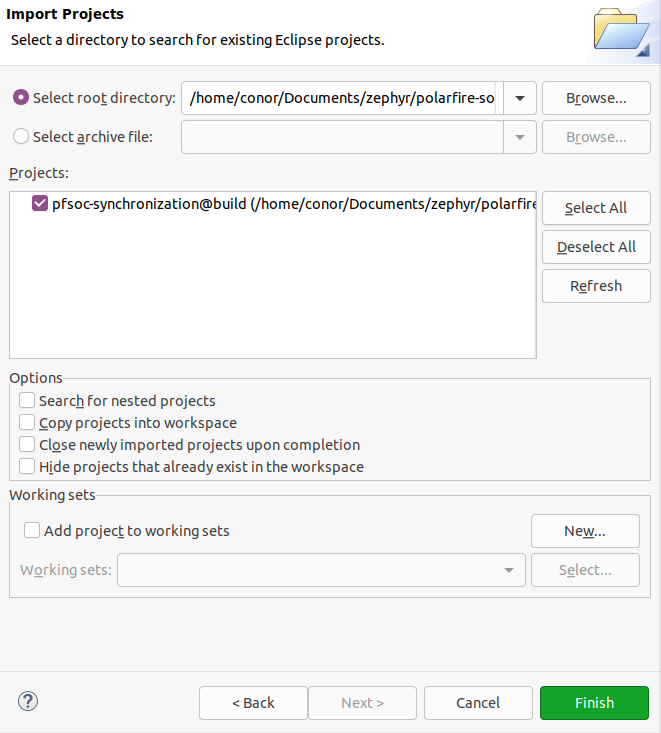
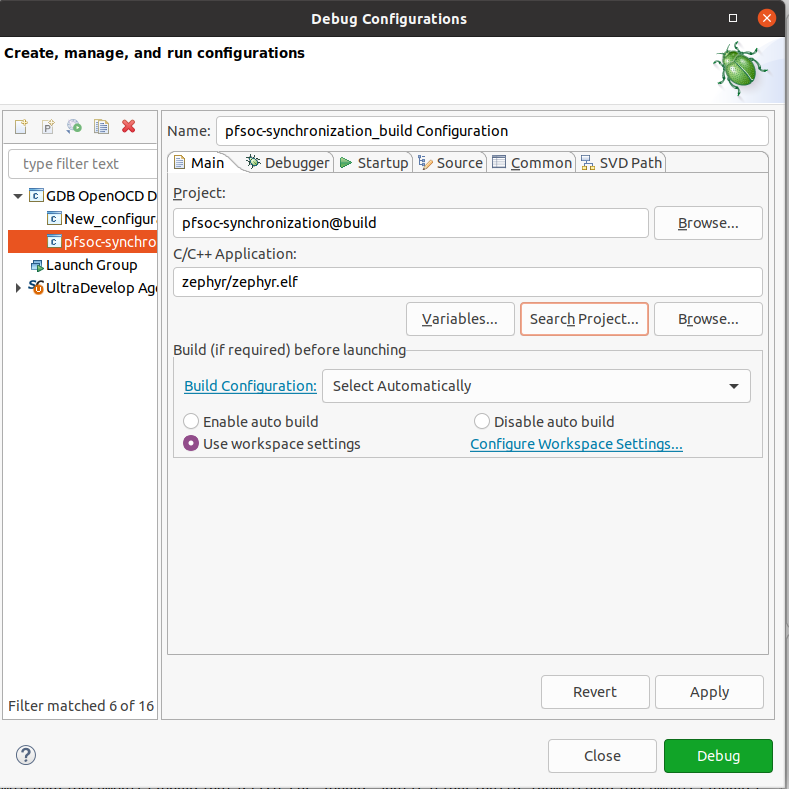
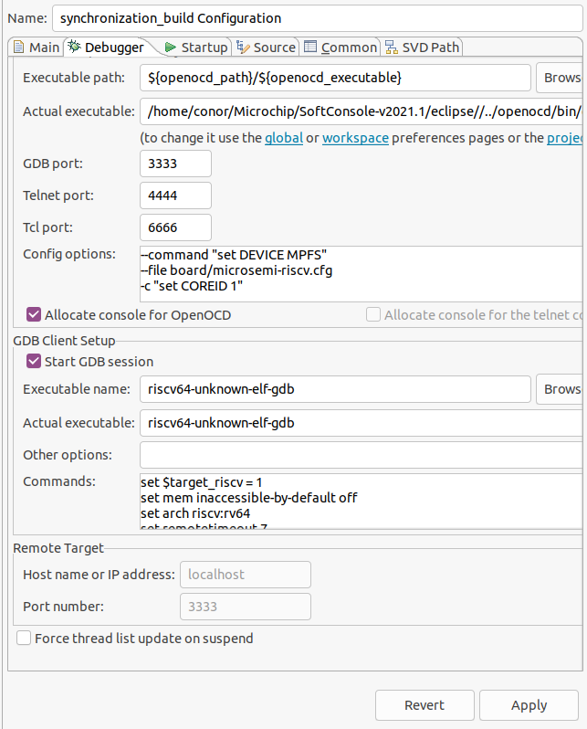
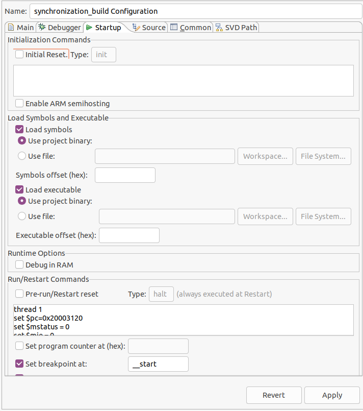

# Microchip PolarFire SoC Zephyr OS Support on Icicle Kit
This repository provides Microchip PolarFire SoC support for the Zephyr RTOS project as well as sample applications which can be run on a Microchip PolarFire SoC Icicle Kit.

# Install Prerequisites

### Prerequisite packages
Before starting, use the `apt` command to install prerequisite packages:
```
$ sudo apt install --no-install-recommends git cmake ninja-build gperf \
  ccache dfu-util device-tree-compiler wget \
  python3-dev python3-pip python3-setuptools python3-tk python3-wheel xz-utils file \
  make gcc gcc-multilib g++-multilib libsdl2-dev
```

### Install the Zephyr OS Software Development Kit
The Zephyr Software Development Kit (SDK) contains toolchains for each of Zephyr’s supported architectures:
```
$ cd ~
$ wget https://github.com/zephyrproject-rtos/sdk-ng/releases/download/v0.12.4/zephyr-sdk-0.12.4-x86_64-linux-setup.run
$ chmod +x zephyr-sdk-0.12.4-x86_64-linux-setup.run
$ ./zephyr-sdk-0.12.4-x86_64-linux-setup.run -- -d ~/zephyr-sdk-0.12.4
```
### Install the Zephyr OS West build system  
Zephyr uses a build system called West to manage the projects dependencies. It can be installed with:
```
$ sudo pip3 install --system west
```

### Clone this repository
```
$ git clone https://github.com/polarfire-soc/polarfire-soc-zephyr-applications.git
```

### Install Zephyr OS additional Python dependencies
There are a number of additional Python dependencies that are required by Zephyr OS to build applications. There is a file with the required python dependencies located in the zephyr directory of this repository and can be installed with:
```
$ cd polarfire-soc-zephyr-applications
$ sudo pip3 install --system -r zephyr/scripts/requirements.txt
```

# Building a Zephyr OS Application for PolarFire SoC Icicle Kit
Zephyr’s build system is based on CMake.

The build system is application-centric, and requires Zephyr-based applications to initiate building the kernel source tree. The application build controls the configuration and build process of both the application and Zephyr itself, compiling them into a single binary.

The zephyr build system is capable of generating eclipse based project configuration files, which can be imported into Microchip's SoftConsole IDE for debugging on a Polarfire SoC Icicle Kit. The following steps will cover:
- initializing the polafire-soc-zephyr-applications repository 
- building an application 
- generating an eclipse project configuration file
- importing the Zephyr application into Microchip SoftConosle IDE
- Debugging the Zephyr application in Microchip SoftConsole IDE


### Initializing the polarfire-soc-applications repository
After cloning this repository, it needs to be initialized using the Zephyr's build system. The `west init` command will initalize the polarfire-soc-applications repository and the `west update` command wiil update Zephyr's submodule dependencies.
```
$ cd zephyr
$ west init -l
$ cd ../
$ west update
$ west zephyr-export
$ source zephyr/zephyr-env.sh
```

### Build an application and generate eclipse project configuration files
The polarfire-soc-zephyr applications repository has an example application called pfsoc-synchronization which is a simple application that demonstrates basic sanity of the kernel.
Two threads (A and B) take turns printing a greeting message to the console,
and use sleep requests and semaphores to control the rate at which messages
are generated. This demonstrates that kernel scheduling, communication,
and timing are operating correctly.

To build this application and generate an eclipse project configuration file which can be used in Microchip SoftConsole:
```
$ west build -p always -b mpfs250t pfsoc-synchronization -G "Eclipse CDT4 - Unix Makefiles"
```

# Debugging Zephyr OS Application On PolarFire SoC Icicle Kit

### Importing the Zephyr application into Microchip SoftConsole IDE
In a SoftConsole workspace, in the top left corner click *File >> import.. >> Existing Projects into Workspace* and click *next*.

Click Browse to navigate to your polarfire-soc-zephyr-applications directory and open it
the application that has been built should show up in the box. Make sure to uncheck the *copy projects into workspace* option. Below is an image showing the import:

[](images/import_zephyr_project.png)

Once you have the Zephyr project imported, you can use the key-command `ctrl+b` to build and rebuild the application. 

### Create SoftConsole Debug configuration
A debug configuration is required to load a zephyr application onto hardware using a combination of openOCD and GDB. To configure a debug configuration in SoftConsole, Click the Debug symbol drop down menu in the SoftConsole toolbar and click *Debug Configurations*. Click on *GDB OpenOCD Debugging* which will generate a new debug configuration. The following snippets describe the configuration of each tab. Make sure to press *Apply* when you have finished configuring the debug configuration

```
Main tab:
---------
## C/C++ Application:
Click Search Project and Select zephyr.elf
```

[](images/main_tab.png)


```
Debugger tab:  
-------------

Check "Start OpenOCD locally" check box 
Executable name: riscv64-unknown-elf-gdb 

## Commands: 
--command "set DEVICE MPFS" 
--file board/microsemi-riscv.cfg 
-c "set COREID 1" 
```
[](images/debugger_tab.png)


```
Startup tab:
---------------

Uncheck "Inital Reset" tab 

## Run/Restart Commands: 

set $target_riscv = 1 
set mem inaccessible-by-default off 
set arch riscv:rv64 
set remotetimeout 7

thread 1 
set $pc=0x20003120 
set $mstatus = 0 
set $mie = 0 
set $mip = 0 
thread 2 
set $pc=__start 
set $mstatus = 0 
set $mie = 0 
set $mip = 0 
thread 3 
set $pc=0x20003120 
set $mstatus = 0 
set $mie = 0 
set $mip = 0 
thread 4 
set $pc=0x20003120 
set $mstatus = 0 
set $mie = 0 
set $mip = 0 
thread 5 
set $pc=0x20003120 
set $mstatus = 0 
set $mie = 0 
set $mip = 0 

Set breakpoint at: __start
```

[](images/start_up_tab.png)


The pfsoc-synchronization application outputs to uart 0 of the Polarfire SoC Icicle Kit. Connect your Polarfire SoC Icicle Kit to your PC using microUSB-USB cable to access serial console. Using the `screen`, command in another console, enter:
```
$ sudo screen -L /dev/serial/by-id/usb-Silicon_Labs_CP2108_Quad_USB_to_UART_Bridge_Controller_*-if00-port0 115200
``` 
Power on the Icicle Kit and press Debug in SoftConsole. The debugger will stop at the break point '__start', press continue in SoftConsole, which will load the Zephyr application on to the Icicle kit.

## Additional Reading
[Zephyr User Manual](https://docs.zephyrproject.org/latest/)

[Zephyr Base](https://github.com/zephyrproject-rtos/zephyr) 

[Polarfire SoC Documentation](https://github.com/polarfire-soc/polarfire-soc-documentation)    


